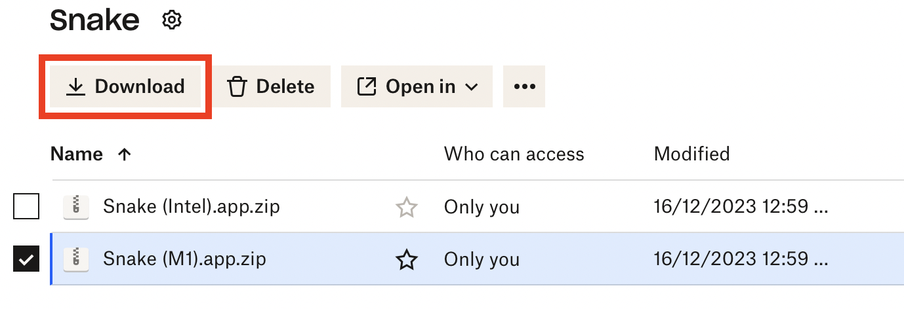
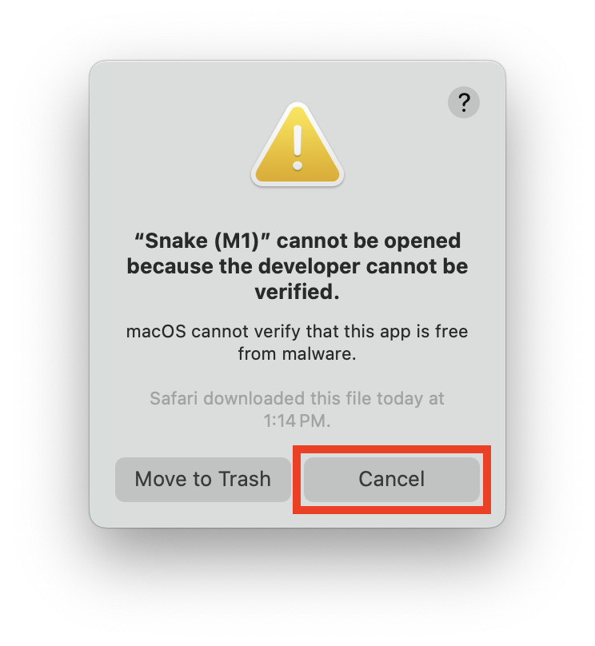
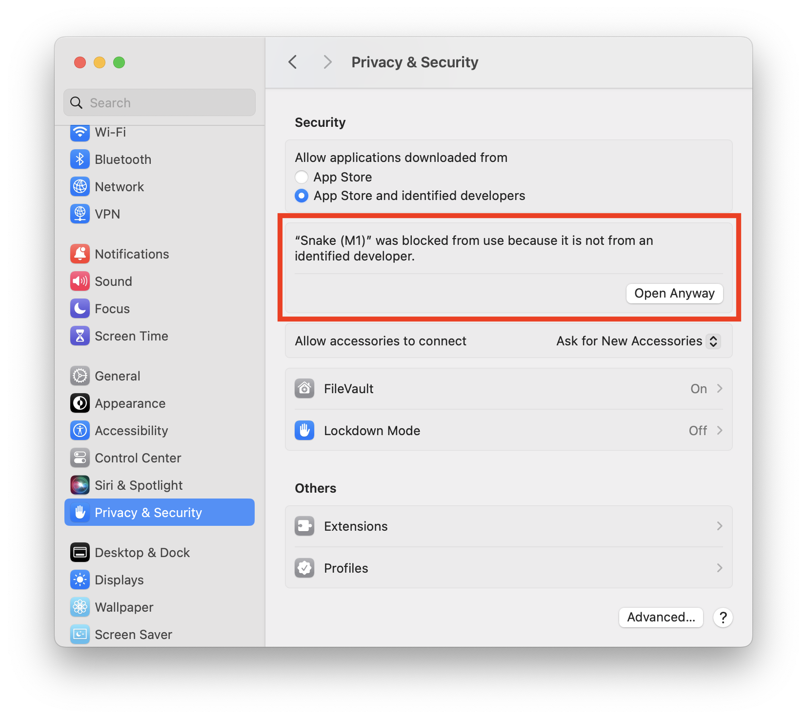

## How to play:

1. Find the game in my Dropbox using this [link](https://www.dropbox.com/scl/fo/9s511y2gy3hxpwcvdnric/h?rlkey=46505xwgup20cggrbujoa9tuj&dl=0).
2. Download the version of Snake based on your processor (Intel or Apple M1 Silicon).
   
4. Drag the Snake app from your downloads folder to your desktop and double-click to open the app.
5. The following warning message will appear. Click "Cancel".
   
7. Navigate to System Settings -> Privacy & Security, and select "Open Anyway".
   
9. On the next pop-up window, select "Open".
   
11. You are ready to play Snake!
    
